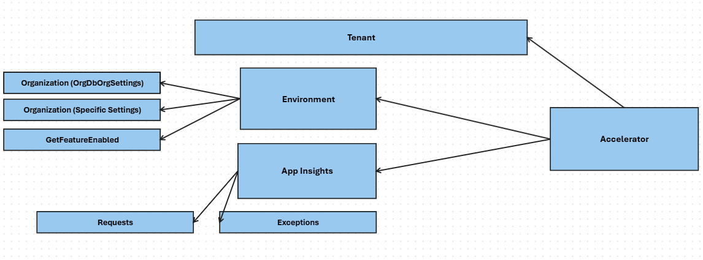

# Power Assessment Tool
This project will build a script to run on an organization's resources (Azure, Dynamics 365 and Power) to produce a list of recommendations. A custom copilot will be used, grounded on internal knowledge and guidance, to analyze the results and provide an action plan.

